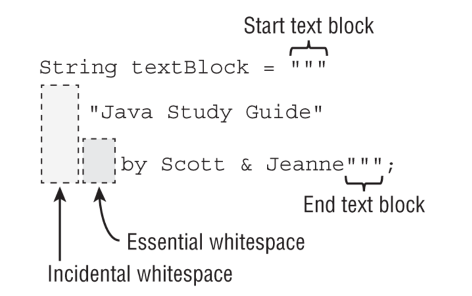

# Building Blocks
## Commands
### Calling java on file with java extension
java directly on .java file, no need to call javac.
```shell
$ java HelloWorld.java
```
And no _HelloWorld.class_ being created!
## packages
From project root folder
```shell
$ javac  -d target/classes  ./src/main/java/org/enricogiurin/ocp17/ch1/*.java

$ java -cp target/classes org.enricogiurin.ocp17.ch1.HelloWorld
```
We have to specify all the single packages if present.

### Alternative cp
```shell
$ java -cp target/classes org.enricogiurin.ocp17.ch1.HelloWorld
$ java -classpath target/classes org.enricogiurin.ocp17.ch1.HelloWorld
$ java --class-path target/classes org.enricogiurin.ocp17.ch1.HelloWorld
```
## Variables
- Local variables **need** to be initialized before to be used;
- Instance variables **do not need** to be initialized before to be used.
### Variable Names
[Possible names for variables](../src/main/java/org/enricogiurin/ocp17/book/ch1/NameOfVariables.java)

### Variables scope
- **Local variables**: In scope from declaration to the end of the block
- **Method parameters**: In scope for the duration of the method
- **Instance variables**: In scope from declaration until the object is eligible for garbage collection
- **Class variables**: In scope from declaration until the program ends

## var
### use of var
var can be only used with local variables, not as an instance variable.
```java
class WrongVar {
    var x = "hello";  //does NOT compile!
    void local() {
        var y = "ciao"; //does compile!
    }
}
```
### var not a reserved key
```java
  public void var() {
    var var = "var";
  }
```
This compiles as **var** is not a reserved key in java

### Garbage Collection
```java
 System.gc();
```
In Java, there are no guarantees about when garbage collection will run. 
The JVM is free to ignore calls to System.gc()

### (apparent) conflict of class names
```java
import org.enricogiurin.ocp17.ch1.fruits.Apple;
import org.enricogiurin.ocp17.ch1.phones.*;

```
In this case will be used class from the package _fruits_ as:  
**importing by class name takes precedence over wildcards!**

## Text Blocks



[Text Blocks](../src/main/java/org/enricogiurin/ocp17/book/ch1/TextBlocks.java)
```java
String tb = """
    Hello
    World""";
```
the code within the `"""` and `"""` is just text.   
text blocks require a break between beginning and the end.
### Example
```java
String s = """aaa"""; //does not compile
```
**Trailing whitespace**: _spazi bianchi finali_ (IT)

```jshelllanguage
jshell> var text = """
   ...> John is a good guy\
   ...>  and he's my friend""";
text ==> "John is a good guy and he's my friend"
```
Remember that a backslash (**\\**) means to skip the line break.

```java
    String s = """
        Hello \
        World
        """;
    System.out.println(s);  //Hello World
```