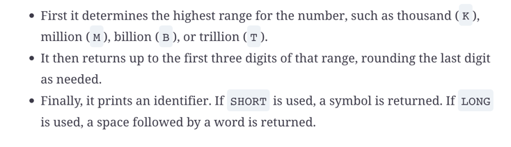

# Localization

## Format java.time
There is a `DateTimeFormatter` class, but not a ~~DateFormatter~~.
### ofPattern
```java
DateTimeFormatter dateTimeFormatter = DateTimeFormatter.ofPattern("dd-MM-yyy - hh:mm:ss");
LocalDateTime now = LocalDateTime.now();
String time = now.format(dateTimeFormatter);
System.out.println(time);  //22-09-2023 - 08:44:55
```
[format java time](../org/enricogiurin/ocp17/book/ch11/FormatJavaTime.java)
### ofLoc
//TBC

### DecimalFormat

*   **#** Omit position if no digit exists for it
*   **0** Put _0_ in position if no digit exists for it.
```java
double wealth = 500_000.45;
final String format = "###,###,###.000000";
NumberFormat nf = new DecimalFormat(format);
String result = nf.format(wealth);
System.out.println(result); //500,000.450000
```
[UsageOfDecimalFormat](../src/main/java/org/enricogiurin/ocp17/book/ch11/UsageOfDecimalFormat.java)

### CompactNumberFormat
A `CompactNumberFormat` rounds to the nearest whole number within the **three-digit** range.
```java
NumberFormat compactNumberInstance = NumberFormat.getCompactNumberInstance();
String format = compactNumberInstance.format(1_000_000);
System.out.println(format); //1M
```

```java
NumberFormat.getCompactNumberInstance(Locale.getDefault(), Style.SHORT),
NumberFormat.getCompactNumberInstance(Locale.getDefault(), Style.LONG);

//either you pass both parameters or none
NumberFormat.getCompactNumberInstance();
```

#### Formatting Rules


Examples: 
- 1_900_000 -> M -> (1),9->2M
- 23_021 -> K - (23),0 -> 23K
- 21_365_891 -> M (21),3 ->21M
- 123,5 - (N/A) -> (123),5 -> 124
- 960_010 -> K -> (960),0 -> 960K
- 0,123 -> (N/A) ->0


### Currency
```java
double amount = 12.3D;
Locale.setDefault(Locale.US);
Locale.setDefault(Category.FORMAT, Locale.ITALY);
Locale.setDefault(Category.DISPLAY, Locale.UK);
System.out.print(NumberFormat.getCurrencyInstance()
    .format(amount));  //12,30 €
```
[Formatting Currency](../src/main/java/org/enricogiurin/ocp17/book/ch11/FormattingCurrency.java)
## Locale
In Java, a locale can be represented by a language code in lowercase, or a language and country code, with language in lowercase and 
country in uppercase.

| Locale | Valid                     | 
|:-------|:--------------------------|
| it     | :white_check_mark:        |
| IT_it  | :x:                       |
| it_IT  | :white_check_mark:        |
| IT_IT  | :x:                       |
| it_it  | :x:                       |
| IT     | :x:    (missing language) |

```java
Local wrong_enUS = new Locale("en_US"));  //wrong way to load
Local right_enUS = new Locale("en", "US"));  //proper way
```
[Creation of Locale](../src/main/java/org/enricogiurin/ocp17/book/ch11/CreationOfLocale.java)

### Locale entities
Oracle defines a locale as a:
- geographical region
- political region
- cultural region
#### Locale Category
* **DISPLAY** : Category used for displaying data about locale
* **FORMAT** : Category used for formatting dates, numbers, or currencies
```java
Locale.setDefault(Category.FORMAT, Locale.ITALY);
Locale.setDefault(Category.DISPLAY, Locale.UK);
```


## Resource Bundle
-  Dog.properties
-  Dog_de.properties
-  Dog_en.properties

```java
Locale.setDefault(new Locale("en", "US"));
var b = ResourceBundle.getBundle("Dog", fr);
```
Java will use **Dog_en.properties** as the matching resource bundle. Since there is no match for French, the default locale is used.

### MessageFormat
```java
var helloByName=Hello, {0} and {1};
var message = MessageFormat.format(format, "John", "Mark"));
//Hello, John and Mark
System.out.print(message);

```