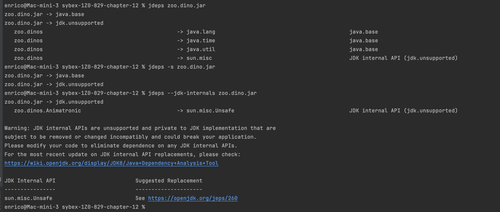

# Modules - commands

## Compiling Module
Extended Form
```shell
javac --module-path mods -d feeding feeding/zoo/animal/feeding/*.java feeding/module-info.java
```
The `-d `option is used to specify the destination directory for the compiled Java class files.

Abbreviated Form
```shell
javac -p mods -d feeding feeding/zoo/animal/feeding/*.java feeding/module-info.java
```

### with classpath
```shell
--class-path <path>, -classpath <path>, -cp <path>
```
WARN: All of these are equivalent!
1. **--class-path**
2. **-classpath**
3. **-cp**
### add-exports
If you must use an internal API that has been made inaccessible by default, then you can break encapsulation using the `--add-exports` command-line option.
```shell
javac -p out --add-exports moduleA/com.example.util=moduleB -d out/moduleB **/.java
```

## Packaging modules
```shell
jar -cvf mods/zoo.visitor.jar -C consumerModule . 
```
## Running module
Extended Form
```shell
java --module-path mods --module zoo.animal.feeding/zoo.animal.feeding.Task
```
Abbreviated Form
```shell
java -p mods -m zoo.animal.feeding/zoo.animal.feeding.Task
```
### show-module-resolution
show module resolution output during startup
```shell
java --show-module-resolution -p mods -m zoo.visitor/zoo.visitor.Tourist
```
When this option is present, the JVM will output information about how it resolved module dependencies.


## describe modules
```shell
java -p mods -d moduleName
java --module-path mods --describe-module moduleName
```

### Example
extended:
```shell
java --module-path mods --describe-module zoo.tours.api
```
compact:
```shell
java -p mods -d zoo.tours.api  
```
output
```shell
zoo.tours.api file:///Users/enrico/github/ocp17/sybex-1Z0-829-chapter-12/mods/zoo.tours.api.jar
exports zoo.tours.api
requires java.base mandated
```
## list
```shell
java --list-modules
```

## describe-module - jar
```shell
jar --file mods/zoo.staff.jar --describe-module
#equivalent
jar --file mods/zoo.staff.jar -d
 ```

## jdeps
The jdeps command lists information about dependencies within a module.
```shell
jdeps –s zoo.dino.jar 
```
* `-s` / `-summary` - Summarizes output
* `--jdk-internals` / `-jdkinternals` - The jdeps -jdkinternals option includes analysis of dependencies on JDK internal APIs
### Screenshot jdeps commands



## jlink
extended
```shell
jlink --module-path mods --add-modules zoo.animal.talks --output zooApp 
```
Abbreviated
```shell
jlink -p mods --add-modules zoo.animal.talks --output zooApp 
```
There is no abbreviated form for the parameter **output**.
* `--add-modules` - List of modules to package
* `--output` - Name of output directory  

This is the contents of the generated folder:
```shell
cd zooAPP/    
ls
```
output:
```shell
bin conf include legal lib man release
```

## jmod
```shell
#generated by CGPT
jmod create --class-path out/moduleA --module-version 1.0 --module-path out out/moduleA.jmod
```
- create
- extract
- describe
- list
- hash