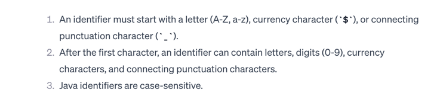
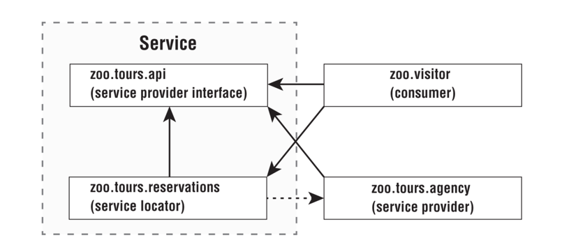
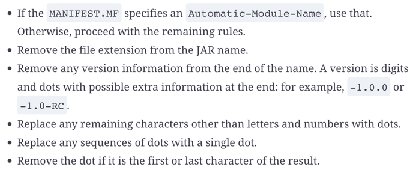

# Modules
## Modules commands
[Commands](ch12-commands.md)
## Example
module-info.java
```java
module zoo.animal.feeding {
  exports zoo.animal.feeding;
}
```

### Module Name Rules
Identifier or identifier segments may not start with a digit nor contain a dash.



#### Examples
- com.enrico : valid
- com.4enrico: **NOT VALID**
- _test: valid
- com.apple$ : valid
- ____$$$$: valid

## Module Directives
### exports
**Packages inside a module are not exported by default.**
```java
exports zoo.animal.talks.content to zoo.staff;
```

### requires
Specifies another module as dependency.
```java
  requires zoo.animal.feeding;
```
#### requires transitive
```java
  requires transitive zoo.animal.care;
```
#### requires mandated
```java
// moduleA/module-info.java
module moduleA {
    requires mandated moduleB;
}
```
The term `mandated` signifies that the dependency is required by the Java platform itself and is not optional.

### opens
```java
    opens zoo.animal.talks.schedule;
    opens zoo.animal.talks.media to zoo.staff;
```

## Creating a service

### Service Provider Interface
interface
```java
public interface Tour {
  String name();
}
```
module
```java
// module-info.java
module zoo.tours.api {
  exports zoo.tours.api;
}
```
The module needs to export the package containing the interface.
### Service Provider Implementation
A service provider is the implementation of a service provider interface.
```java
public class TourImpl implements Tour {
  public String name() {
    return "service name";
  }
}
```
module
```java
// module-info.java
module zoo.tours.agency {
  requires zoo.tours.api;
  provides zoo.tours.api.Tour with zoo.tours.agency.TourImpl;
}
```
provide _interface_ with _implementation_.

It contains exactly one implementation of the service provider interface.
### Service Locator
A service locator can find any classes that implement a service provider interface.
Methods of `ServiceLoader`

- `ServiceLoader.load()` is a static method
-  `ServiceLoader stream()` is an instance method!

```java
List<Dog> all = new ArrayList<>();
//here it's using the iterator of ServiceLoader
for (Dog current : ServiceLoader.load(Dog.class)) {
  all.add(current);
}
```

#### stream
In order to call `stream()` I need an instance of `ServiceLoader` which I get through `load()`.
```java
List<Dog> list = ServiceLoader.load(Dog.class)
    .stream()
    .map(Provider::get)
    .toList();
```
[ServiceLoader](https://docs.oracle.com/en/java/javase/17/docs/api/java.base/java/util/ServiceLoader.html)

module-info of the Service Locator.
```java
// module-info.java
module zoo.tours.reservations {
  exports zoo.tours.reservations;
  requires zoo.tours.api;
  uses zoo.tours.api.Tour;
}
```
`zoo.tours.reservation` is the package containing the `ServiceLocator`.

### Consumer
```java
public class Tourist {
    public static void main(String[] args) {
        Tour tour = TourFinder.findSingleTour();
        System.out.println("Single tour: " + tour);
        List<Tour> tours = TourFinder.findAllTours();
        System.out.println("# tours: " + tours.size());
    }
}
```
module-info
```java
// module-info.java
module zoo.visitor {
    requires zoo.tours.api;
    requires zoo.tours.reservations;
}
```
It requires the modules of the service provider interface and the module of the service locator.

### Combining modules of a service
It is most logical to combine the **service locator** and **service provider interface** because neither has
a direct reference to the service provider (implementation).

A service is composed by:
 - service provider interface
 - service locator

## Module Types
### Named Modules

A named module must be on the module path and contain a `module-info` file.

### Automatic Modules
An _automatic module_ appears on the module path but **does not contain** a `module-info` file.   
In an automatic module **all packages are exported**.

### Unnamed Modules
An _unnamed module_ appears on the classpath.  
Unlike an automatic module, it is on the classpath rather than the module path.

In an unnamed module, a `sealed` class must include all its subclasses within the same package.


## Migration Strategies
- Bottom-Up Migration Strategy: 
- Top-Down Migration Strategy: starts by moving all the modules to the module path as automatic modules

### Naming Strategy

The rules for determining the name of the `module-info`, from the jar file name,  include:
- removing the **extension**
- changing **special characters** to periods (.)
- Additionally, we remove the **version information from the end**.



### Examples
* lizard-^-cricket-^-1.0.0-SNAPSHOT.jar --> lizard.cricket
* cat-enrico2.jar --> cat.enrico2

## Modules supplied by JDK
### java based modules (some)
* java.logging
* java.management
* java.naming
* java.desktop
* java.sql
### JDK based modules (some)
* jdk.javadoc
* jdk.jdeps
* jdk.net

## References
- Scott Selikoff, Jeanne Boyarsky - OCP Oracle® Certified Professional Java SE 17 Developer Study Guide Exam 1Z0-829
- www.selikoff.net/ocp-17/
- [sybex-1Z0-829-chapter-12](https://github.com/boyarsky/sybex-1Z0-829-chapter-12)