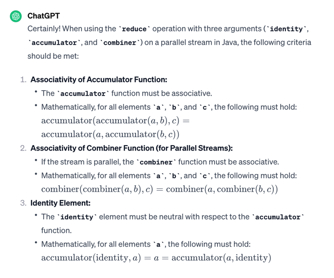
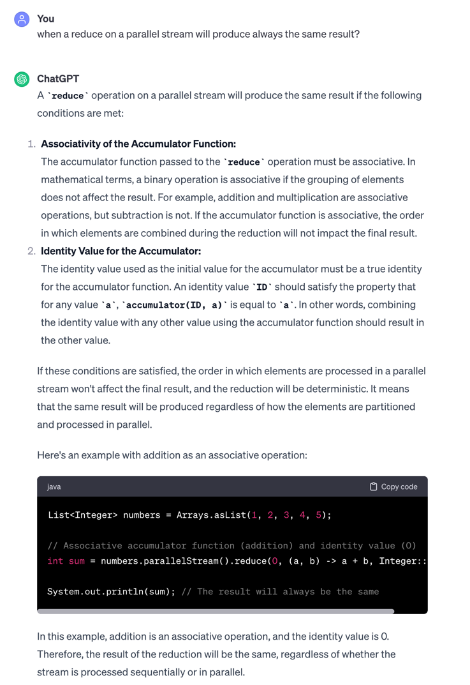

# Concurrency
### Thread interrupt
`interrupt()` only impacts a thread in a **WAITING** or **TIMED_WAITING** state.  
Calling `interrupt()` on a thread in a **NEW** or **RUNNABLE** state has no impact.
Interrupting a thread that is not alive need not have any effect.

### Parallel Stream
The `forEachOrdered()` method will process the elements in the order in which they are stored in the
stream.
### Reduce
```java
Stream<T> stream

<U> U reduce(U identity,
    BiFunction<U,? super T,U>accumulator,
    BinaryOperator<U> combiner)
```
#### Rules
- identity: same type as the return type
- accumulator: 1st parameter as the return type, 2nd parameter as the source stream
- combiner: 1st and 2nd parameter as the return type

Performs a reduction on the elements of this stream, using the provided identity, accumulation and
combining functions. 
The accumulator and combiner must be:
* associative;
* non-interfering;
* stateless.





[Parallel vs Sequential reduce](../src/main/java/org/enricogiurin/ocp17/book/ch13/parallelstream/ReduceParallelVsSequential.java)

#### Sequential
To obtain an equivalent sequential stream of an existing parallel stream.
```java
List<Integer> sequentialResult = numbers.parallelStream()
    .sequential()  // This makes the stream sequential
    .collect(Collectors.toList());
```

## Methods of Executors
```java
    ExecutorService executorService = Executors.newSingleThreadExecutor();
    ExecutorService cachedExecutorService = Executors.newCachedThreadPool();
    ExecutorService fixedExecutorService = Executors.newFixedThreadPool(10);
    //scheduled methods
    ScheduledExecutorService scheduledExecutorService = Executors.newScheduledThreadPool(10);
    ScheduledExecutorService singleScheduledExecutorService = Executors.newSingleThreadScheduledExecutor();
```

### ScheduledExecutorService
```java
public interface ScheduledExecutorService extends ExecutorService {...
}
```
`scheduleAtFixedRate() `can result in the same action being executed by two threads at the same time.

## ExecutorService
### Methods

```java
Future<?> submit(Runnable task)

<T> Future<T> submit(Callable<T> task)
    
void execute(Runnable command) //from the parent Executor
```
Calling get on Future<?> returns null.
### Future
```java
V get(long timeout, TimeUnit unit) throws InterruptedException, ExecutionException,TimeoutException
```
Mind to catch the checked exception when you call Future.get(...)
```java
try {
    result = future.get(1, TimeUnit.SECONDS);
    //mind the three checked exceptions to be caught
    } catch (InterruptedException | ExecutionException | TimeoutException e) {
    throw new RuntimeException(e);
}
```

### Shutdown
```java
void executor(){
  ExecutorService executorService = Executors.newSingleThreadExecutor();
  try{
      executorService.submit(printInventory);
    }finally{
      //if you do not call this the method
      //the code will run but never terminate,
      executorService.shutdown();
    }
}
```

## Concurrent Collections
### Sorted Concurrent Collections
If you see `SkipList` as part of a concurrent class name, it means it is sorted in some way.
 - `ConcurrentSkipListSet`
 - `ConcurrentSkipListMap`

## Requirements for Parallel Reduction with collect()
* The stream is parallel.
* The parameter of the collect() operation has the `Characteristics.CONCURRENT` characteristic.
* Either the stream is unordered or the collector has the characteristic `Characteristics.UNORDERED`.

[Check Characteristic](../src/main/java/org/enricogiurin/ocp17/book/ch13/parallelstream/CollectorCharacteristic.java)