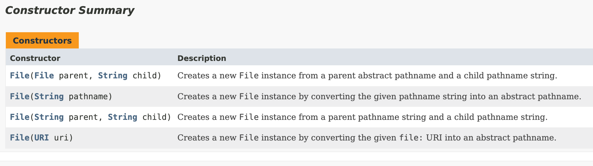

# I/O

## Methods of java.io.File
```java
File notExisting = new File("notExistingFile");
//if the file does not exist, it does not throw an exception
boolean isDeleted = notExisting.delete();
System.out.println(isDeleted); //false
```
## File constructors
<figure>
   
  <figcaption>Constructor Summary</figcaption>
</figure>

### File vs Path
```java
java.io.File;
java.nio.file.Path;
```
## Path
`Path` is immutable. This line is ignored:
```java
Path p1;
p1.normalize().relativize(Path.of("/lion"));
```

### Resolve
Calling resolve() with an absolute path as a parameter returns the absolute path.
```java
var p1 = Path.of("/tmp")
var p2 = Path.of("enrico")
var p3 = Path.of("/users")

var resolve = p1.resolve(p2); // /tmp/enrico
resolve = p2.resolve(p1);   //  /tmp
resolve = p1.resolve(p3)  // /users
resolve = p3.resolve(p1)  // /tmp
```

### relativize
Both paths to be either absolute or relative.
```java
Path path1 = Path.of("tmp/fish.txt"); //relative
Path path2 = Path.of("/user/friendly/birds.txt");  //absolute
// Exception in thread "main" java.lang.IllegalArgumentException: 'other' is different type of Path
System.out.println(path1.relativize(path2));
```


### toRealPath
```java
Path pom = Path.of("pom.xml");

///Users/enrico/github/ocp17/1Z0-829-preparation/pom.xml
System.out.println(pom.toRealPath());
```

`toRealPath() `throws `IOException` if the path does not exist.

### System.in System.out
**Do not close!**  
Because these are static objects, the System streams are shared by the entire application.  
The JVM creates and opens them for us. They can be used in a try-with-resources statement
or by calling close(), although closing them is not recommended. 


## java.nio.file.Files methods
### Files.deleteIfExists()
```java
public static boolean deleteIfExists(Path path)
                              throws IOException
```
It throws a checked exception.

### createDirectories
```java
var dir = Path.of("/flip");
dir = Files.createDirectories(dir);
```
Unlike the createDirectory method, an exception is not thrown if the directory could not be created because it already exists.  
It is _createDirectories()_ and **NOT** _mkdir()_.

### Read lines
`readAllLines`
```java
//this returns a list, everything is in memory
List<String> listOfLines = Files.readAllLines(path);
```
`lines`
```java
//this returns a Stream (not in memory)
Stream<String> stream = Files.lines(pom)
```
### isSameFile
```java
boolean result = Files.isSameFile(p1, p2);
```
The system might check if the files really exist if the `p1.equals(p2)` returns false.  
If check is done and one of these two do not exist, after check:
```java
Exception in thread "main" java.nio.file.NoSuchFileException: src/a
```
[IsSameFile](../src/main/java/org/enricogiurin/ocp17/book/ch14/IsSameFile.java)

#### Mismatch
Finds and returns the position of the first mismatched byte in the content of two files, or -1L if there is no mismatch.
```java
public static long mismatch(Path path,
 Path path2) throws IOException
```
```java
Path hello = Path.of("/tmp/hello.txt");
long mismatch = Files.mismatch(hello, hello);  //-1
```

### Browsing folders
```java
public static Stream<Path> walk(Path start,
   FileVisitOption… options) throws IOException
 
public static Stream<Path> walk(Path start, int maxDepth,
   FileVisitOption… options) throws IOException
```
### File Attributes
- BasicFileAttributes
- BasicFileAttributeView  
[File Attributes](../src/main/java/org/enricogiurin/ocp17/book/ch14/ReadAttributes.java)


## IO Classes
| Class Name           | Level | 
|----------------------|:-----:|
| FileInputStream      |  low  | 
| FileOutputStream     |  low  |  
| FileReader           |  low  |  
| FileWriter           |  low  |  
| BufferedInputStream  | high  |  
| BufferedOutputStream | high  |  
| BufferedReader       | high  |  
| BufferedWriter       | high  |  
| ObjectInputStream    | high  |  
| ObjectOutputStream   | high  |  
| PrintStream          | high  |  
| PrintWriter          | high  |  

### Writer
`Writer` is an abstract class
```java
Writer writer = new PrintWriter(dest)
```
## Reader.mark()
<figure>
   
  <figcaption>Reader.mark(limit)</figcaption>
</figure>

### StringReader.mark()

_Marks the present position in the stream. Subsequent calls to reset() will reposition the stream to this point.
Params: readAheadLimit – Limit on the number of characters that may be read while still preserving the mark. 
Because the stream's input comes from a string, there is no actual limit, so this argument must not be negative, but is otherwise ignored._

## Serializable
If Object implemented `Serializable`, all objects would be serializable by default, 
defeating the purpose of having the Serializable interface. 
[Serialization Example](../src/main/java/org/enricogiurin/ocp17/book/ch14/serialization/SerializationOfRecord.java)
### Deserialize Object

```java
try {
    ....  
//this is the proper way to read multiple items from a file
    while(true){
        var obj=ois.readObject();
        if(obj instanceof Person p){
          //do something
        }
    }
}catch(EOFException e){}
```


## Console
Always checks if console is not null before using it.
```java
Console console = System.console();
```
wrong way:
```java
Console console = new Console(); //does not compile
```
### Console methods
```java
String input = console.readLine("Type your name: ");
char[] pwd = console.readPassword("Type your pwd: ");
```

```java
Reader reader = console.reader();
PrintWriter writer = console.writer()
```
[Usage of Console](../src/main/java/org/enricogiurin/ocp17/book/ch14/UsageOfConsole.java)

## Stream closed
`System.out` and `System.err` when declared within the try with resources can no longer log if used after 
they are closed.  
[System.err closed](../src/main/java/org/enricogiurin/ocp17/book/ch14/SystemErrClosed.java)