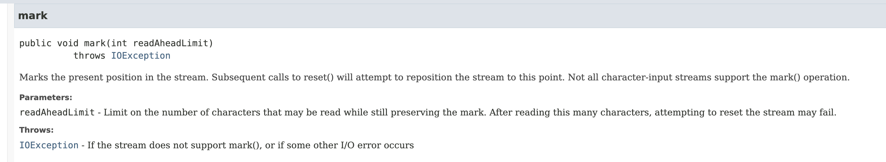

# I/O
### File vs Path
```java
java.io.File;
java.nio.file.Path;

```
## Path
Path is immutable. This line is ignored:
```java
Path p1;
p1.normalize().relativize(Path.of("/lion"));
```

### Resolve
Calling resolve() with an absolute path as a parameter returns the absolute path.
```java
jshell>
var p1 = Path.of("/tmp")
p1 ==> /tmp

jshell> var p2 = Path.of("enrico")
p2 ==> enrico

jshell> var p3 = Path.of("/users")
p3 ==> /users

jshell> p1.resolve(p2)
$4 ==> /tmp/enrico

jshell> p2.resolve(p1)
$5 ==> /tmp

jshell> p1.resolve(p3)
$6 ==> /users

jshell> p3.resolve(p1)
$7 ==> /tmp

```

### relativize
Both paths to be absolute or relative.
```java
    Path path1 = Path.of("tmp/fish.txt");
    Path path2 = Path.of("/user/friendly/birds.txt");

    System.out.println(path1.relativize(path2));
```
Exception in thread "main" java.lang.IllegalArgumentException: 'other' is different type of Path

### toRealPath
```java
    Path pom = Path.of("pom.xml");
   
    ///Users/enrico/github/ocp17/1Z0-829-preparation/pom.xml
    System.out.println(pom.toRealPath());

```

_toRealPath()_ throws IOException if the path does not exist

### System.in System.out
**Do not close!**  
Because these are static objects, the System streams are shared by the entire application.  
The JVM creates and opens them for us. They can be used in a try-with-resources statement
or by calling close(), although closing them is not recommended. 
## java.nio.file.Files methods
### Files.deleteIfExists()
```java
public static boolean deleteIfExists(Path path)
                              throws IOException
```
It throws a checked exception.

### createDirectories
```java
var dir = Path.of("/flip");
dir = Files.createDirectories(dir);
```
Unlike the createDirectory method, an exception is not thrown if the directory could not be created because it already exists.

### Files.deleteIfExists()

## IO Classes
| Class Name           | Level | 
|----------------------|:-----:|
| FileInputStream      |  low  | 
| FileOutputStream     |  low  |  
| FileReader           |  low  |  
| FileWriter           |  low  |  
| BufferedInputStream  | high  |  
| BufferedOutputStream | high  |  
| BufferedReader       | high  |  
| BufferedWriter       | high  |  
| ObjectInputStream    | high  |  
| ObjectInputStream    | high  |  
| PrintStream          | high  |  
| PrintWriter          | high  |  


## Reader.mark()
<figure>
   
  <figcaption>Reader.mark(limit)</figcaption>
</figure>

### StringReader.mark()

_Marks the present position in the stream. Subsequent calls to reset() will reposition the stream to this point.
Params: readAheadLimit – Limit on the number of characters that may be read while still preserving the mark. 
Because the stream's input comes from a string, there is no actual limit, so this argument must not be negative, but is otherwise ignored._

## Serializable
If Object implemented Serializable, all objects would be serializable by default, 
defeating the purpose of having the Serializable interface. 