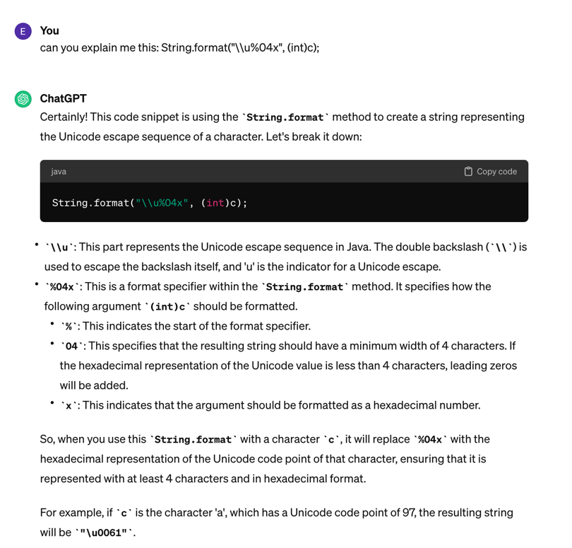

# Operators

## Casting
### Dangerous Cast
```java
void dangerousCast() {
    int[][] array = {{1,2,3}, {2}};
    //keep in mind that int[] is an object;
    Object[] arrObj = array;
    //compiles but exception at runtime
    //Exception in thread "main" java.lang.ArrayStoreException: java.lang.String
    arrObj[0] = "hello";
}
```
## Compound operators
Convert the result of the binary operation to the type of the left-hand variable (implicit casting).
Example
```java
long aLong = 2;
// -incompatible types: possible lossy conversion from double to long
//aLong = 2 - 1.0;  //DOES NOT COMPILE!
    
//compound operator applies casting automatically
aLong -=1.0;  //THIS works (compound operator)
```

```java
int anInt =5;
long aLong = 6;
//int result = anInt + aLong; //DOES NOT COMPILE
int result = anInt;
//minor warning: Implicit cast from 'long' to 'int' in compound assignment can be lossy
result +=aLong;
System.out.println(result);  //11
```
### Compound operators — tricky
```jshelllanguage
jshell> long x = 5L
    x ==> 5

    jshell> x = x +3.4
    |  Error:
    |  incompatible types: possible lossy conversion from double to long
    |  x = x +3.4
    |      ^----^

    jshell> x -=3.4
    $20 ==> 1
```

## Arithmetic operators
`+ - / *`

The arithmetic operands are cast to int before to proceed
```java
short s=5, t=6;
//fails because s*t is an int
short result = s * t;//fails!
```

## Bitwise operator ~
```java
int x = 8;
int y =~x; //-9
```
Alternatively, you can use the following formula to calculate the 2's complement of an integer x:

`-(x + 1)`

For example, to find the 2's complement of the integer 8, we can use this formula as follows:

`-(8 + 1) = -9`

### Trick for binary
0000  0   
0001  1 

but going back   
0001   1   
0000   0   
1111  -1

## Numeric Promotion Rules

1. If two values have different data types, Java will automatically promote one of the values to the larger of the two data types.
2. If one of the values is integral (intero IT) and the other is floating-point, Java will automatically promote the integral value to the floating-point value's data type.
3. Smaller data types, namely, byte, short, and char, are first promoted to int any time they're used with a Java binary arithmetic operator with a variable (as opposed to a value), even if neither of the operands is int.
4. After all promotion has occurred and the operands have the same data type, the resulting value will have the same data type as its promoted operands.

### Cases
```java
short x = 5;
short y = 6;
//does not compile as short are promoted to int if there is an operator
//short result = x + y;  //does NOT compile!
int result = x + y; //this compiles
```
```java
byte a=2, b=3;
//byte result = a +b;  //does NOT compile
int result = a+b;  //compiles
```
```java
byte a=2, b=3;
//compound operator
b +=a;  //this compiles!
System.out.println(b);  //5
```
## LHS vs RHS
in the statement:  
```java
int x = 5;   
```

the terms "left-hand side" (LHS) and "right-hand side" (RHS) refer to specific parts of the assignment.

Left-hand side (LHS): This refers to the variable that is being assigned a value. In your example, x is the LHS because it's the variable that will store the value.

Right-hand side (RHS): This refers to the value that is being assigned to the variable. In your example, 5 is the RHS because it's the value that is assigned to the variable x.

So, to summarize:

LHS: x
RHS: 5

## Primitive assignment
```java
int x = 5;
//allowed
double d = x;
//not allowed
x = d;
```

## Casting
All the primitive types can be cast to Object.
```java
    byte b = 4;
    short s = 5;
    int i = 56;
    long l = 100L;
    float f = 4.5F;
    double d = 5.98D;
    char c = 'a';
    boolean bo = false;

    //all of these can be cast to Object
    Object oB = (Object)b;
    Object oS = (Object)s;
    Object oI = (Object)i;
    Object oL = (Object)l;
    Object oF = (Object)f;
    Object oD = (Object)d;
    Object oC = (Object)c;
    Object oBo = (Object)bo;
    //inconvertible types; cannot cast 'int' to 'java.lang.Float'
    //Float aFloat = (Float)i;  DOES NOT COMPILE
```
[Casting](../src/main/java/org/enricogiurin/ocp17/book/ch2/Casting.java)

## Java Operator Precedence
By decreasing order, highest to the lowest.

| Operator                        | Symbols and examples                            | Evaluation       |
|---------------------------------|-------------------------------------------------|------------------|
| Post-unary operators            | `expression++`, `expression--`                  | Left-to-right    |
| Pre-unary operators             | `++expression`, `--expression`                  | Left-to-right    |
| Other unary operators           | `-`, `!`, `~`, `+`, `(type)`                    | Right-to-left    |
| Cast                            | `(Type)reference`                               | Right-to-left    |
| Multiplication/division/modulus | `*`, `/`, `%`                                   | Left-to-right    |
| Addition/subtraction            | `+`, `-`                                        | Left-to-right    |
| Shift operators                 | `<<`, `>>`, `>>>`                               | Left-to-right    |
| Relational operators            | `<`, `>`, `<=`, `>=`, `instanceof`              | Left-to-right    |
| Equal to/not equal to           | `==`, `!=`                                      | Left-to-right    |
| Logical AND                     | `&`                                             | Left-to-right    |
| Logical exclusive OR            | `^`                                             | Left-to-right    |
| Logical inclusive OR            | `\|`                                            | Left-to-right    |
| Conditional AND                 | `&&`                                            | Left-to-right    |
| Conditional OR                  | `\|\|`                                          | Left-to-right    |
| Ternary operators               | `boolean expression ? expression1 : expression2` | Right-to-left   |
| Assignment operators            | `=`, `+=`, `-=`, `*=`, `/=`, `%=`, `&=`, `^=`,  | Right-to-left    |
| Arrow operator                  | `->`                                            | Right-to-left    |


## Instanceof
### null case
null instanceof T: **always false**
```java
//it always returns false
if(null instanceof String){
  System.out.println("It's null");
}
```
T instanceof null: **DOES NOT COMPILE!**
```java
Object object = new String("A");
//this does not compile!
// if(object instanceof null){}
```
## Primitive types (CGPT)
| Primitive Type | Size (in bits)         | Signed/Unsigned | Range                                       |
|-----------------|------------------------|------------------|-------------------------------------------|
| `byte`          | 8                      | Signed           | -128 to 127                               |
| `short`         | 16                     | Signed           | -32,768 to 32,767                         |
| `int`           | 32                     | Signed           | -2^31 to 2^31 - 1                         |
| `long`          | 64                     | Signed           | -2^63 to 2^63 - 1                         |
| `float`         | 32                     | Signed           | IEEE 754 single-precision floating-point  |
| `double`        | 64                     | Signed           | IEEE 754 double-precision floating-point  |
| `char`          | 16                     | Unsigned         | 0 to 65,535 (Unicode characters)          |
| `boolean`       | Not precisely defined  | N/A            | `true` or `false`                           |

1. The size of a `boolean` type is not precisely defined in terms of bits, as it depends on the JVM implementation. However, it is typically represented as a single byte.
### unicode 
**Heads-up**: `'\u0061'` is represented in hex: 6*16+1 = 97 (in decimal)
```java
    char c = '\u0061';
    char d = 'a';
    System.out.println(c == d); //true
    System.out.println('\u0061');
    int charAsInt = c;
    System.out.println("char as int: "+charAsInt);  //97
```

#### char to unicode
```java
char c = 'a';
String unicode = String.format("\\u%04x", (int)c);
System.out.println(unicode); // \u0061
```
