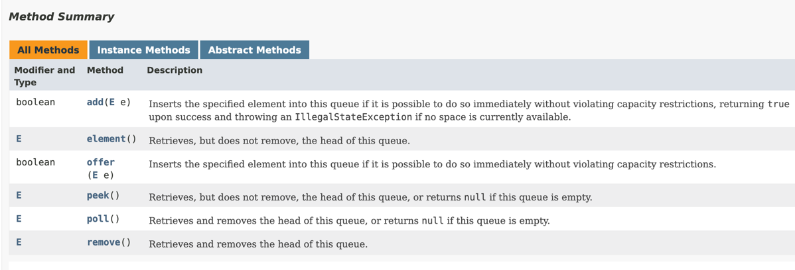

# Collections and Generics
## Generics
````java
public class Money<T> {
    private T currency;
    public T createT() {
        //Type parameter 'T' cannot be instantiated directly
        // return new T();
    }
}
````
### Diamond Operator
```java
List<String> list = new ArrayList<>();
```
The diamond operator `<>` cannot be used on the left side of the assignment.

```java
HashSet<> set = new HashSet<Object>();  //does not compile!
```
### Instantiate with generics
[Example](../src/main/java/org/enricogiurin/ocp17/book/ch9/generics/InstantiateClassWithGenerics.java)
## Bounding Generic Types
### Upper-Bounded wildcards

```java
List<? extends Number> listOfInteger = new ArrayList<>();
//does not compile...what if it's a list of AtomicInteger
//listOfInteger.add(new Integer(3));  

//does not compile...what if it's a list of Integer
//listOfInteger.add(new AtomicInteger(2)); 
```
We cannot add an element to a list declared s upper bounded wildcards!

### Lower-Bounded wildcards

```java
List<? super IOException> exceptions = new ArrayList<Exception>();
exceptions.add(new IOException("error"));// yes we can add it
exceptions.add(new FileNotFoundException("error"));// yes we can add it

//we cannot add an Exception as it could be a list of IOException and Exception is not an IOException
//exceptions.add(new Exception("error"));
```
We can only add element whose type is **IOException** or one of its children.

```java
//List<? super IOException> ioExceptions = new ArrayList<FileNotFoundException>();  //does NOT compile
List<? super IOException> ioExceptions = new ArrayList<Exception>();  //compiles
```

[Example wildcard](../src/main/java/org/enricogiurin/ocp17/book/ch9/generics/CollectionsOfGenericsWithWildcard.java)
## Collections
### Immutable Collections
```java
List<String> list = List.of("a", "b");
Set<String> set = Set.of("a", "b");  //accepts a vararg
List<String> listCopyOf = List.copyOf(list);  //accepts a Collection
List<String> listCopyOfSet = List.copyOf(set);
Set<String> setCopyOf = Set.copyOf(set);
Set<String> setCopyOfList = Set.copyOf(list);
```
#### Sorting an immutable collection
```java
List<Integer> list = List.of(5, 3, 1);
//I cannot sort an immutable collection!
//Exception in thread "main" java.lang.UnsupportedOperationException
//	at java.base/java.util.ImmutableCollections.uoe(ImmutableCollections.java:142)
Collections.sort(list);
```
### TreeSet
````java
Comparator<Integer> comparator = (n1,n2)->n1-n2;
TreeSet<Integer> set1 = new TreeSet<>(comparator);
TreeSet<Integer> set2 = new TreeSet<>(Set.of(1, 2, 3));
````

### List
remove - mind the overloading of `remove()`
```java
//this remove the element at index 2, because here we call remove(int index)
list.remove(2); //[5,3,1]
//this removes element 1 as here we call remove(Object obj)
list.remove(Integer.valueOf(1)); //[5, 3]
```
[Overloading of remove](../src/main/java/org/enricogiurin/ocp17/book/ch9/RemoveFromList.java)

### Comparator
package: java.util
```java
int compare(T o1, T o2);
```

### Comparable
package: java.lang
```java
int compareTo(T o1);
```

### Queue


### Deque


[API Deque](../src/main/java/org/enricogiurin/ocp17/book/ch9/UsageOfDeque.java)

```java
    //The offer() method inserts an element at the end of the queue
    Deque<String> q = new ArrayDeque<>();
    q.offer("dog"); // [dog]
    q.offer("cat"); // [dog, cat]
    q.offer("bunny"); // [dog, cat, bunny]
    System.out.print(q.peek() + " " + q.size()); // dog 3
```

```java
public interface Deque<E> extends Queue<E> {/**/}
```

### Map
#### foreach
```java
    Map<Integer, String> map = buildMap();
    BiConsumer<Integer, String> biConsumer =
        (key, value)-> System.out.println("key: %s - value: %s".formatted(key, value));
    //NOTE! it uses a BIConsumer, not a consumer!
    map.forEach(biConsumer);
```


 - LinkedList implements Deque
 - ArrayDeque implements Deque
### Collections and null values
- `ArrayList`: allows null
- `LinkedList`: allows null
- `HashSet`: allows null
- `TreeSet`: **DOES NOT** allow null
```java
Set<Integer> set = new TreeSet<>();
//Exception java.lang.NullPointerException: Cannot invoke "java.lang.Comparable.compareTo(Object)" because "k1" is null
set.add(null);
```
